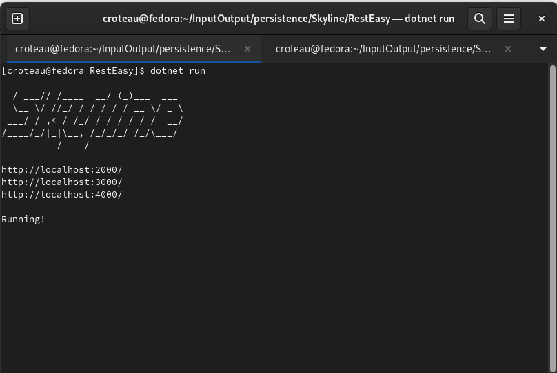

# Home


<figure><figcaption></figcaption></figure>

## Launcher.cs

```
RestEast/Launcher.cs
```

```csharp
using Skyline;

public class Launcher{            
    public static int Main(String[] args){
        SkylineServer server = new SkylineServer();
        server.setPorts(new Int32[]{2000, 3000, 4000});
        server.start();
        return 0;
    }
}
```

## RestEasy.csproj

```
RestEasy/RestEasy.csproj
```

````xml
```xml
<Project Sdk="Microsoft.NET.Sdk">

  <PropertyGroup>
    <OutputType>Exe</OutputType>
    <TargetFramework>net7.0</TargetFramework>
    <ImplicitUsings>enable</ImplicitUsings>
    <Nullable>enable</Nullable>
    <WarningLevel>0</WarningLevel>
    <StartupObject>Launcher</StartupObject>
  </PropertyGroup>

  <ItemGroup>
    <Reference Include="Skyline">
      <HintPath>Libs\Skyline.dll</HintPath>
    </Reference>
  </ItemGroup>

</Project>
```
````

## The .csproj must have the same name as the project directory matching case.

First off, I appreciate your support. Forgive me, if you downloaded for Nuget, your version has limited resources, meaning concurrency is limited. Purchasing the enterprise version has unlimited resources and performance is determined by your CPU. If you are interested in the enterprise version, please feel free to contact me @ mike@ae0n.net.

This site is dedicated to helping you build .Net Systems using Skyline. Skyline is in essence ASP.NET + ASP MVC.NET + IIS packaged into one single composite runnable. You will not need to deploy to the IIS Application server. Running Skyline is as easy as running a simple command:

`$ dotnet run`

That's it!

<figure><figcaption></figcaption></figure>


Let's get started. [Quick Start!](quick-start.md)
