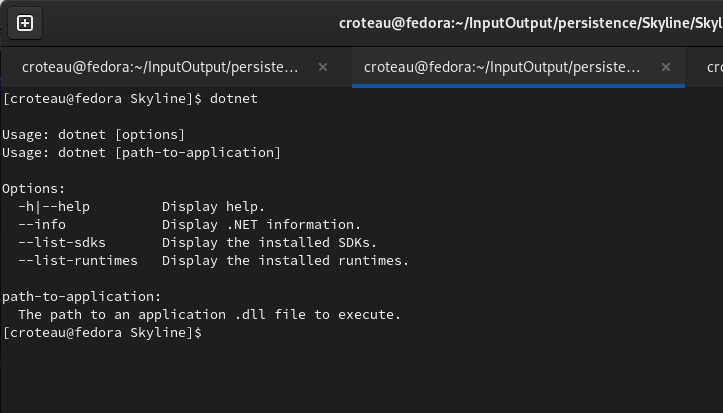

# Quick Start

In this tutorial we will create a simple project that will serve up plain text "hi".

What do you need to get started?&#x20;

* .Net 7
* Visual Studio Code
* Skyline

That's it! Ha!

We assume you have .Net installed and can run the following command:&#x20;

`$ dotnet`&#x20;

and see something like the following:

<figure><figcaption></figcaption></figure>

Now we will create our project structure, meaning all of the directories and build file.


<figure><figcaption></figcaption></figure>


We will complete to the two class files but before we do, let's create our RestEasy.csproj build file and add Skyline to our project.

## RestEasy.csproj

The most important parts to this: the RestEasy.Launcher \<StartupObject> and the reference to the Skyline.dll which you downloaded.

````xml
```xml
<Project Sdk="Microsoft.NET.Sdk">

  <PropertyGroup>
    <OutputType>Exe</OutputType>
    <TargetFramework>net7.0</TargetFramework>
    <ImplicitUsings>enable</ImplicitUsings>
    <Nullable>enable</Nullable>
    <WarningLevel>0</WarningLevel>
    <StartupObject>RestEasy.Launcher</StartupObject>
  </PropertyGroup>

  <ItemGroup>
    <Reference Include="Skyline">
      <HintPath>Libs\Skyline.dll</HintPath>
    </Reference>
  </ItemGroup>

</Project>
```
````

What's important is the Skyline.dll definition in the Libs/ directory. Now would be a good time to add it to your project, just copy and paste the Skyline.dll file into the Libs/ directory

The next parts will go quick and we will have our project ready to run. If you haven't done it already, go ahead and create both the `IndexController.cs` and the `Launcher.cs` class files in the `RestEasy/` directory.

## Launcher.cs

````csharp
```csharp
using Skyline;

public class Launcher{
    public static int Main(String[] args){
         SkylineServer server = new SkylineServer();
         server.setPorts(new Int32[]{2000, 3000, 4000});
         server.start();
         return 0;
    }
}
```
````

I'm hoping this looks simple, with comparisons to SpringBoot, Node.js, Python SimpleHttpServer, but hopefully much much much more powerful.

First you instantiate the SkylineServer passing in the port number in which you wish to bind Skyline to. This main class is the entry and will run Skyline for us.

Next let's create our Controller class to handle incoming requests.

## IndexController.cs

````csharp
```csharp
using Skyline;
using Skyline.Model;
using Skyline.Annotation;

namespace RestEasy{

    [NetworkController]
    public class IndexController{
        
        ApplicationAttributes applicationAttributes;

        public IndexController(){}

        public IndexController(ApplicationAttributes applicationAttributes){
            this.applicationAttributes = applicationAttributes;
        }

        [Text]
        [Get(route="/")]
        public String index(){
            return "Hi!";
        }
    }
}
```
````

You will need to define a field to support an incoming ApplicationAttributes, a placeholder for application settings to be passed around to our Controllers. Think of it as a Properties file. We will also need two constructors, one no argument constructor, the other with a ApplicationAttributes argument passed to it. This is required as of now but may be changed in the future. I just thought it would be good to have in addition to a .Properties file which we will get to when we build a more complex system.

If you are familiar with Java, then you might be familiar with Annotations. In the C# World we will be using Attributes, the same as Annotations to help assist our system. You will notice the \[NetworkController] attribute, the \[Text] attribute and the \[Get(route="/")] attribute. Let's go through each one.

## \[NetworkController]

This attribute tells Skyline to register the class file as a controller. When requests come into the system, Skyline routes to a specific controller based on the endpoint or path.

## \[Get(route="/"]

The Get attribute tells the Skyline to register the attached method to the Http Route or Endpoint /. When a Get request comes in @ "/", the method defined gets called. The other two Http verb attributes \[Post("")] and \[Delete("")] are covered as well.&#x20;

## &#x20;\[Text]&#x20;

\[Text] tells Skyline to register the endpoint as a return type of "text/plain".&#x20;

Let's run the application, open a terminal, cd into the project and run:

`$ dotnet run`

&#x20;Then browse to:

`http://localhost:2000/`

You should see a simple page that renders "Hi!"

&#x20;

