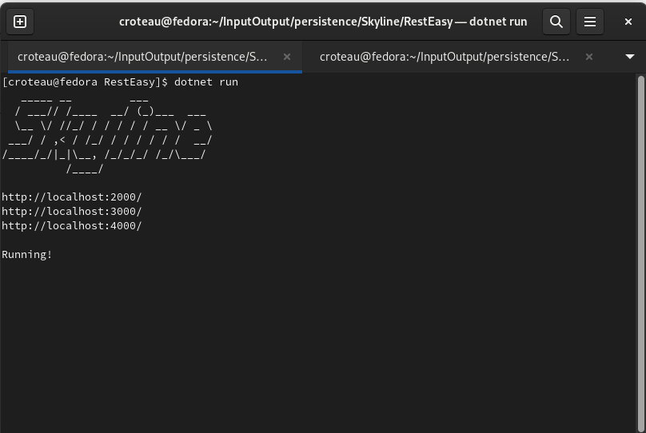

# Step 8: Run it!

We can finally run our project. Cd into the top level Persistence directory using your terminal and run:

```
$ dotnet run
```

You should see the following:

<figure><figcaption></figcaption></figure>

