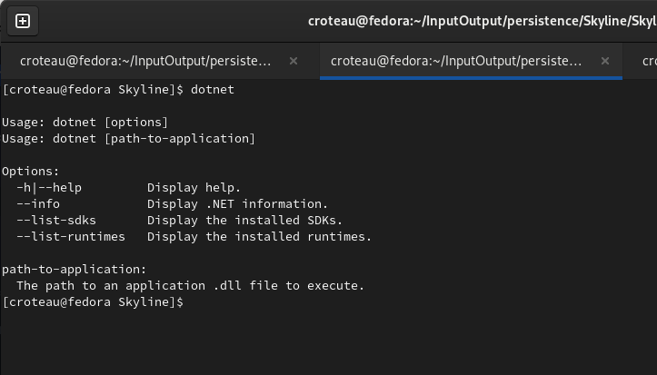

# Step 1 : Project Setup

What do you need to get started?&#x20;

* .Net 7
* Visual Studio Code
* Skyline

We assume you have .Net installed and can run the following command:&#x20;

`$ dotnet`&#x20;

and see something like the following:

<figure><figcaption></figcaption></figure>

Now we will create our project structure, meaning all of the directories and build file. Go ahead and create all of the following directories.

<figure><figcaption></figcaption></figure>

Just pay attention to the **src/** folder. You are going to need a Model, Repo, and Controller folder. &#x20;

We will create all of the necessary class files before we do, let's create our **Persistence.csproj** build file and add Skyline to our project.

## Persistence.csproj

The most important parts to this: the Persistent.Launcher \<StartupObject> reference to the Skyline.dll which you downloaded and the **SQLlite** definition.

````xml
```xml
<Project Sdk="Microsoft.NET.Sdk">

  <PropertyGroup>
    <OutputType>Exe</OutputType>
    <TargetFramework>net7.0</TargetFramework>
    <ImplicitUsings>enable</ImplicitUsings>
    <Nullable>enable</Nullable>
    <WarningLevel>0</WarningLevel>
    <StartupObject>Persistence.Launcher</StartupObject>
  </PropertyGroup>

  <ItemGroup>
    <Reference Include="Skyline">
      <HintPath>libs\Skyline.dll</HintPath>
    </Reference>
    <PackageReference Include="System.Data.SQLite.Core" Version="1.0.117" />
  </ItemGroup>

</Project>
```
````

What's important is the **Skyline.dll** definition in the **libs/** directory. Now would be a good time to add it to your project, just copy and paste the **Skyline.dll** file into the **libs/** directory:


Next, we will create all of our necessary Model objects otherwise known as Domains.&#x20;
