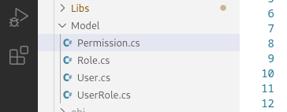

# Step 2 : Models

Let's go ahead and create our Models. Here is a list of the Models we will need in order to create our complete system with built in authentication and authorization.

* User
* Role
* UserRole
* Permission

## User.cs

```
Location: Envato/Model/User.cs
```

````csharp
```csharp
using System;

namespace Model {

    public class User{
        public int id;
        public String email;
        public String password;

        public int getId() {
            return this.id;
        }

        public void setId(int id) {
            this.id = id;
        }

        public String getEmail() {
            return this.email;
        }

        public void setEmail(String email) {
            this.email = email;
        }

        public String getPassword() {
            if(this.password != null){
                return this.password;
            }
            return "";
        }

        public void setPassword(String password) {
            this.password = password;
        }
    }

}
```
````

Our User Model class will represent the person or people that will be created on our system. These users will be able to login, logout and have their own authorization rules.&#x20;

## Role.cs

```
Location: Envato/Model/Role.cs
```

````csharp
```csharp
using System;

namespace Model{

    public class Role{
        int id;
        String description;

        public int getId() {
            return this.id;
        }

        public void setId(int id) {
            this.id = id;
        }

        public String getDescription() {
            return this.description;
        }

        public void setDescription(String description) {
            this.description = description;
        }
    }
}
```
````

The Role class is very simple.&#x20;

## UserRole.cs

```
Location: Envato/Model/UserRole.cs
```

````csharp
```csharp
using System;

namespace Model{

    public class UserRole{
        int id;
        int userId;
        int roleId;

        public int getId() {
            return this.id;
        }

        public void setId(int id) {
            this.id = id;
        }

        public int getUserId() {
            return this.userId;
        }

        public void setUserId(int userId) {
            this.userId = userId;
        }

        public int getRoleId() {
            return this.roleId;
        }

        public void setRoleId(int roleId) {
            this.roleId = roleId;
        }

    }
}
```
````

The UserRole links the User to one or many Roles.&#x20;

## Permission.cs

```
Location: Envato/Model/Permission.cs
```

````csharp
```csharp
using System;

namespace Model{

    public class Permission{
        int id;
        int userId;
        String permission;

        public int getId() {
            return this.id;
        }

        public void setId(int id) {
            this.id = id;
        }

        public int getUserId() {
            return this.userId;
        }

        public void setUserId(int userId) {
            this.userId = userId;
        }

        public String getPermission() {
            return this.permission;
        }

        public void setPermission(String permission) {
            this.permission = permission;
        }

    }
}
```
````

Our final Models directory should look like this:

<figure><figcaption></figcaption></figure>


Next we will create our Controller classes to handle all of our incoming traffic.
