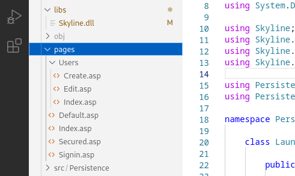

# Step 6: Pages, Layouts, Styles

If you haven't done so yet, create folders for your views/pages and your layout. This is what they should look like:

<figure><figcaption></figcaption></figure>

Let's create all of our pages. First lets create our layout file, we will call it Default.asp. We are going use .asp for the file extension, however you can use what ever extension you wish.

## Default.asp

`Location: pages/Default.asp`

````html
```html
<html>
    <head>
        <title>User Maintenance</title>
        <link rel="stylesheet" href="/assets/Default.css">
    </head>
    <body>
        <c:if spec="${sessionuser == ''}">
            <a href="/signin">Signin</a>
        </c:if>
        <c:if spec="${sessionuser != ''}">
            welcome ${sessionuser} <a href="/signout">Signout</a>
        </c:if>
        
        <a href="/users/create">Create User</a> <a href="/users">List Users</a>

        <c:if spec="${message != ''}">
            <p class="alert">${message}</p>
        </c:if>

        <c:content/>
    </body>
</html>
```
````

## Index.asp

`Location: pages/Index.asp`

```html
<h1>Hi</h1>

<p>An example app</p>
```

## Secured.asp

`Location: pages/Secured.asp`

````html
```html
<h1>Secured.</h1>
<a href="/users/create">Create User</a> <a href="/users">List Users</a>
```
````

## Signin.asp

`Location: pages/Signin.asp`

````html
```html
<h1>Signin</h1>

<form action="/signin" method="post">
    <input type="text" name="email" value="abc@plsar.net"/>
    <input type="text" name="password" value="effort."/>
    <input type="submit" value="signin"/>
</form>
```
````

## Create.asp

`Location: pages/Users/Create.asp`

````html
```html
<h1>Create User</h1>
<form action="/users/save" method="post">
    <label>Email</label>
    <input type="text" name="email" value=""/>

    <label>Password</label>
    <input type="text" name="password" value=""/>
    <input type="submit" value="save"/>
</form>
```
````

## Edit.asp

`Location: pages/Users/Edit.asp`

````html
```html
<h1>Edit User # ${user.id}</h1>
<form action="/users/update/${user.id}" method="post">
    <label>Email</label>
    <input type="text" name="email" value="${user.email}"/>

    <label>Password</label>
    <input type="text" name="password" value="${user.password}"/>
    <input type="submit" value="update"/>
</form>
```
````

## Index.asp

`Location: pages/Users/Index.asp`

````html
```html
<c:if spec="${message != ''}">
    <p>${message}</p>
</c:if>

<h1>Users</h1>
<ul>
    <c:foreach items="${users}" var="user">
        <li>
            ${user.email} 
            <a href="/users/edit/${user.id}">Edit</a> 
            <a href="/users/delete/${user.id}">Delete</a>
        </li>
    </c:foreach>
</ul>
```
````

## Default.css

`Location: assets/Default.css`

````css
```css
body{
    padding:40 150px;
    background:#f8f8f8;
}
.alert{border:solid 1px #000; padding:3px 7px;}
```
````


